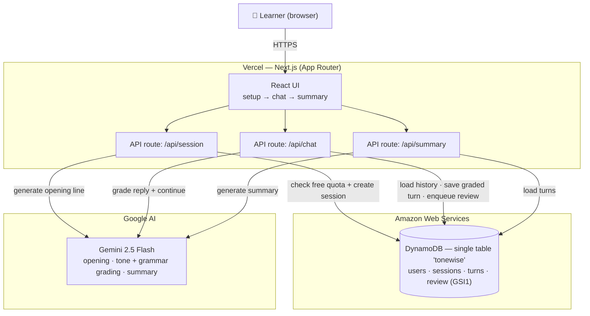
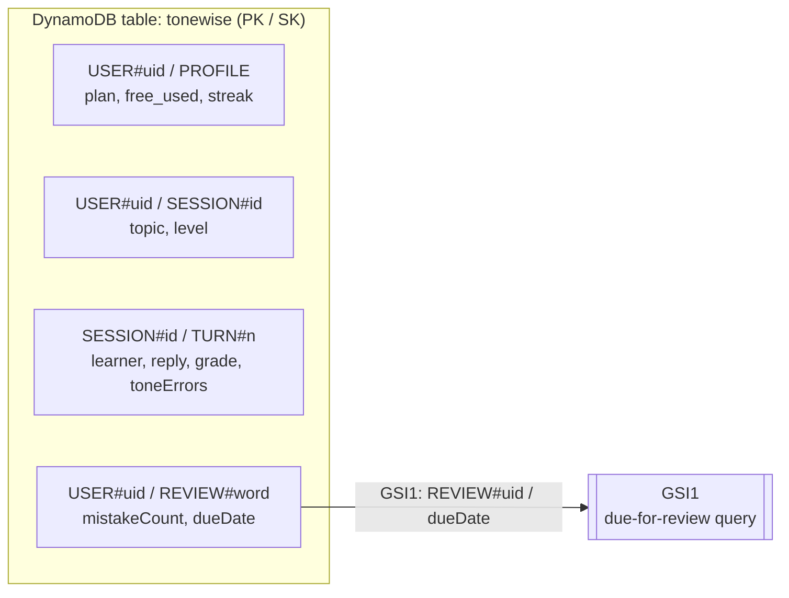

# ToneWise — Architecture

> GitHub renders the Mermaid diagrams below automatically. For the submission image, paste a block into **https://mermaid.live** and export PNG/SVG.

## System architecture

## DynamoDB single-table design (`tonewise`)

One table holds every entity type (single-table design); a GSI powers the spaced-repetition review queue.

| Access pattern | PK | SK | Index |
|---|---|---|---|
| Get/update user (plan, free_used, streak) | `USER#<uid>` | `PROFILE` | base table |
| List a user's sessions | `USER#<uid>` | `SESSION#<id>` | base table |
| Read all turns in a session | `SESSION#<id>` | `TURN#<n>` | base table |
| Words **due for review** (spaced repetition) | `USER#<uid>` | `REVIEW#<word>` | **GSI1** → `REVIEW#<uid>` / `dueDate` |

- **Pay-per-request** billing → scales to zero, scales up automatically (fits the hackathon's "designed for scale" theme).
- Tone errors from each graded turn **auto-enqueue** into the review queue → a real, demoable DynamoDB write + GSI read pattern, not just a flag.

## Request flow — a chat turn
1. Browser `POST /api/chat`
2. `getTurns(sessionId)` ← **DynamoDB** (conversation history)
3. `chatTurn(...)` → **Gemini** (tone + grammar grade, reply)
4. `saveTurn(...)` + `addReviewItems(...)` → **DynamoDB** (persist turn, enqueue review words)
5. JSON response (reply + tone grade) → UI

## Proof artifacts for submission
- **This diagram** (export PNG from mermaid.live)
- **AWS DB screenshot:** AWS Console → DynamoDB → Tables → `tonewise` → *Explore items* (show real rows)
- **Vercel:** project URL + Team ID
